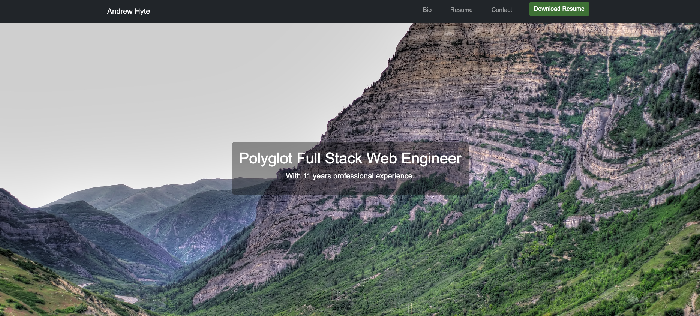

# Andrew Hyte's Resume Website

Welcome to my personal resume website! This site showcases my professional experience, skills, and projects as a Lead Frontend Software Engineer.



## 🌟 Features

- Responsive design with Bootstrap
- Interactive sections using GSAP and ScrollMagic
- Downloadable resume in PDF format
- Google Analytics for tracking
- Hot Module Reloading (HMR) with Vite
- Hosted on GitHub Pages

### Resume

The main idea of the website is to showcase a resume and only have to update it in one place. The resume is written in the site config.json (see below for detailed documentation) and is then automatically converted to a PDF when the user clicks the download button.

## 🚀 Getting Started

### Prerequisites

- [Node.js](https://nodejs.org/) installed
- [Git](https://git-scm.com/) installed

### Installation

1. **Fork the repository:**

   Click the "Fork" button at the top-right corner of this page to create a copy of this repository under your GitHub account.

2. **Clone the repository:**

   ```bash
   git clone https://github.com/hytea/resume-website.git
   cd resume-website
   ```

## Customization

1. **Update the resume:**

   Open the `index.html` file and update the resume content as needed.

2. **Update the Google Analytics tracking ID:**

   Open the `index.html` file and update the `G-XXXXXXXXXX` value with your Google Analytics tracking ID.

3. **Update the favicon:**

   Replace the `andrew-icon.svg` file with your own favicon.

4. **Update the site title:**

   Open the `index.html` file and update the value with your own site title.

5. **Update the site description:**

   Open the `index.html` file and update the Meta data with your own site description.

6. **Update the site bio:**

   Open the `index.html` file and update the bio with your own information.

7. **Update the resume:**

   See the `Configuration` section below.

8. **Update the Social Links:**

   Open the `index.html` file and update the social links with your own information.

## 🛠 Configuration

The website configuration can be managed via the `config.json` file located in the `public` directory. This allows for easy updates to the resume content without modifying the HTML directly.

### Configurable Sections

1. **Experience:**

   - **title**: Job title
   - **dateRange**: Duration of the job
   - **company**: Name of the company
   - **location**: Job location
   - **responsibilities**: List of responsibilities

2. **Skills:**
   You can add zero or more skills sections. The title of the section is the key and the value is the content. The key should use underscores instead of spaces and all the correct capitalization as you would like it to appear on the resume. You can also use HTML tags to style the content. For example, you can use `<span class="feature">` to feature some important text.

3. **Education:**
   - **degree**: Degree obtained
   - **date**: Graduation date
   - **institution**: Name of the institution
   - **location**: Location of the institution

### Example `config.json`

```json
{
  "experience": [
    {
      "title": "Lead Software Engineer",
      "dateRange": "Feb 2023 - Jul 2024",
      "company": "ON Platform DBA. GameOn",
      "location": "Remote, Heber City, UT",
      "responsibilities": [
        "Led development of B2B portal.",
        "Implemented robust CI/CD pipeline."
      ]
    }
  ],
  "skills": {
    "Computer_Science": "JavaScript. <span class=\"feature\">Typescript</span>. React.",
    "Personal_and_Communication": "Self-starter. <span class=\"feature\">Team player</span>."
  },
  "education": [
    {
      "degree": "B.S. Computer Science",
      "date": "Dec 2015",
      "institution": "Brigham Young University",
      "location": "Provo, UT"
    }
  ]
}

### Hosting

1. **GitHub Pages:**
   Since the site is a static website, you can host it on GitHub Pages for free.
   - Create a new repository on GitHub.
   - Push your code to the repository.
   - Go to the repository settings.
   - Scroll down to the GitHub Pages section.
   - Select the `main` branch and click `Save`.
   - Your site will be published at `https://<username>.github.io/<repository-name>`.
   - You can also add a custom domain by following the instructions [here](https://docs.github.com/en/pages/configuring-a-custom-domain-for-your-github-pages-site).
```
